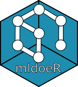

<!-- README.md is generated from README.Rmd. Please edit that file -->

```{r, include = FALSE}
knitr::opts_chunk$set(
  collapse = TRUE,
  comment = "#>",
  fig.path = "man/figures/README-",
  out.width = "100%"
)
```

# mldoeR 

<!-- badges: start -->
[](https://lifecycle.r-lib.org/articles/stages.html#experimental)
<!-- badges: end -->

`mldoeR` stands for **M**ixed-**l**evel **d**esigns **o**f **e**xperiments in **R**.
The goal of the package is to provide:

* Access to the catalog of regular four-and-two-level designs created by Bohyn, Schoen & Goos.
* Functions to characterize these designs, using different criteria such as:
  + Word length pattern
  + Aberration
  + ...

## Installation

The package currently cannot be install from [CRAN](https://CRAN.R-project.org).
Once a released version is created, it will be available.

At the moment, you can install the experimental version of the package from github using:

```{r eval=FALSE}
#install.packages("devtools")
devtools::install_github("ABohynDOE/mldoeR")
```


## Contributions

If you want to contribute, do not hesitate to create a pull request on github or send me an email.


